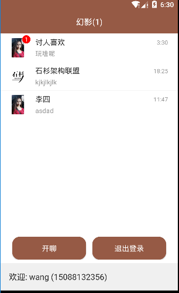

## 幻影Android客户端

# 服务端地址：

[Phantom](https://github.com/wangjianfengnb/Phantom)


# SSL

用Portecle工具转成bks格式，最新版本是1.10。
下载链接：https://sourceforge.net/projects/portecle/
运行protecle.jar将xxx.jks转换成xxx.bks 然后放到android客户端的assert目录下

```　
>File -> open Keystore File -> 选择证书库文件 -> 输入密码 -> Tools -> change keystore type -> BKS -> save keystore as -> 保存即可
```

# 示例效果





# 使用API

## 初始化
在Application启动类：

     PhantomClient.getInstance().initialize(this, "serverUrl");
     
## 登录、退出登录

登录
```
 PhantomClient.getInstance().login("user","token");
```

退出登录：

```
 PhantomClient.getInstance().logout();
```

## 回话管理：

添加回话监听器

```
PhantomClient.getInstance().chatManager().addOnConversationChangeListener(new OnConversationChangeListener() {
        @Override
        public void onConversationChange(Conversation conversation, boolean isNew) {
            // do something
        }
    });
```

移除会话监听器

```
 PhantomClient.getInstance().chatManager().removeOnConversationChangeListener(this);
```

加载回话：

```
PhantomClient.getInstance().chatManager().loadConversation(1,10, new LoadConversationListener(){

        @Override
        public void onLoadCompleted(List<Conversation> conversationList) {
            
        }
    });
```

打开回话，打开聊天页面之前调用

```
PhantomClient.getInstance().chatManager().openConversation(Conversation.TYPE_C2C, "userAccount", new OnConversationLoadListener() {
    @Override
    public void onConversationLoad(Conversation conversation) {
        
    }
});
```

关闭回话,在退出聊天页面时调用

```
PhantomClient.getInstance().chatManager().closeConversation(mConversation.getConversationId());
```

加载回话消息：

```
PhantomClient.getInstance().chatManager().loadMessage(conversation, new OnLoadMessageListener() {
    @Override
    public void onMessage(List<Message> messages) {
        
    }
});
```
回话消息监听：

```
PhantomClient.getInstance().chatManager().addOnMessageListener(new OnMessageListener() {
    @Override
    public void onMessage(Message message) {
          // handle message
    }

    @Override
    public Long conversationId() {
        return "conversationId";
    }
});
```

发送消息：

```
 Message message = mConversation.createTextMessage(text);
 PhantomClient.getInstance().chatManager().sendMessage(message); 
```

为消息添加发送状态监听器

```
message.setOnStatusChangeListener(new OnStatusChangeListener() {
        @Override
        public void onStatusChange() {
            
        }
    });
```

